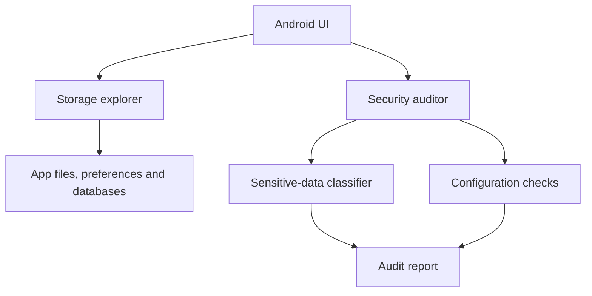

# Secure Storage Inspector


An Android security utility for inspecting application storage and identifying common mobile data-protection risks in controlled test environments.

> Use this project only on devices and applications you own or are explicitly authorized to assess.

## Capabilities

### Storage inspection

- Browse application files and cache usage
- Inspect SharedPreferences and Room/SQLite databases
- Identify potentially sensitive values in local storage
- Review database encryption status

### Security analysis

- Detect JWTs, API keys and credential-like patterns
- Flag debuggable applications and excessive permissions
- Produce a structured audit report for developers
- Present findings through a Material Design interface

## Architecture



## Technology

- Java
- Android SDK 36, minimum API 24
- Material Components
- View Binding
- AndroidX Security Crypto
- Gradle Kotlin DSL

## Build and run

```bash
git clone https://github.com/Sultan-zd/SecureStorageInspector.git
cd SecureStorageInspector

# Linux/macOS
./gradlew assembleDebug

# Windows
# gradlew.bat assembleDebug
```

Install the generated debug APK on an emulator or authorized test device. The project can also be opened in Android Studio for interactive development.

## Validation

```bash
./gradlew test
./gradlew lint
./gradlew assembleDebug
```

GitHub Actions runs the Android build and static checks for pushes and pull requests.

## Security considerations

This tool handles potentially sensitive local data. Do not use it on another person's device without permission. Do not include extracted credentials, tokens, personal data or screenshots containing secrets in issues, commits or documentation.

The pattern-based classifier is a triage aid, not a complete mobile security assessment. Findings require human review and should be validated against the application threat model.

## Documentation

See [`DOCUMENTATION_TECHNIQUE.md`](DOCUMENTATION_TECHNIQUE.md) for implementation details.
